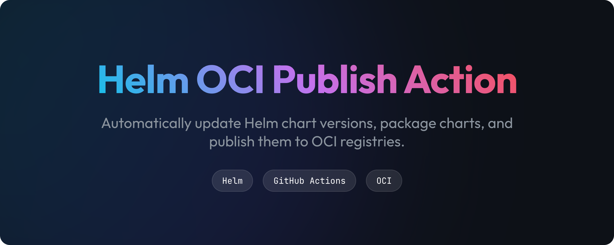
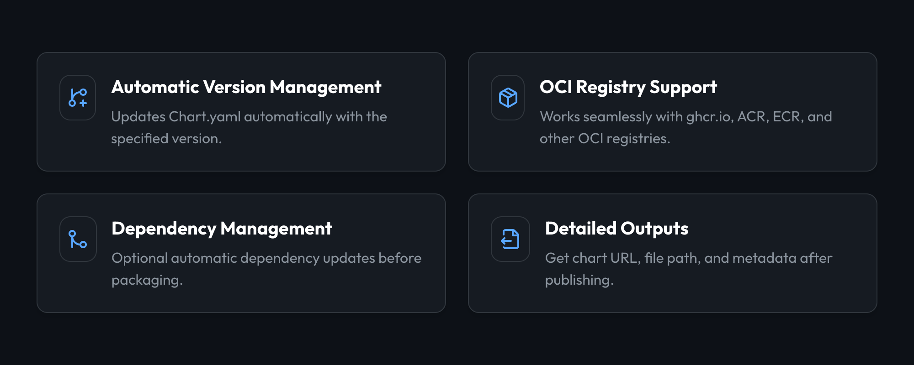
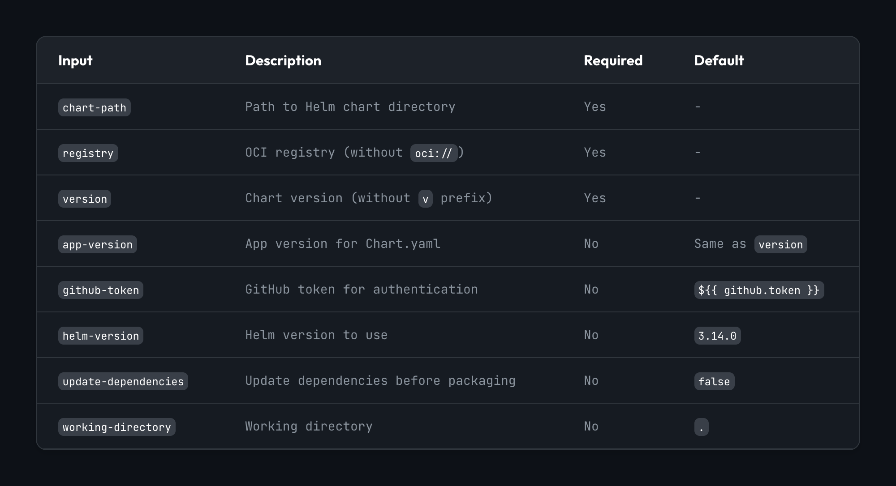
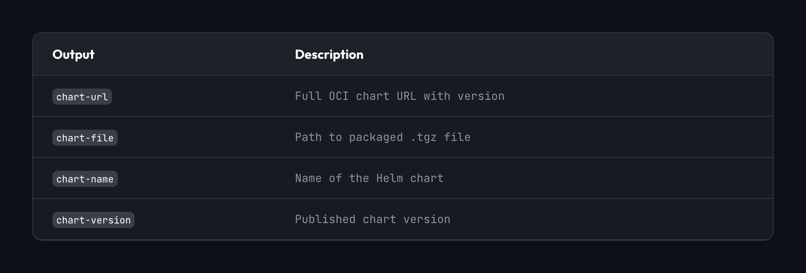

A GitHub Action that automatically updates Helm chart versions, packages charts, and publishes them to OCI registries.

## Features



## Usage

> [!TIP]
> Check out the [examples/workflows/](examples/workflows/) directory for usage examples.


<!-- 
### Basic Example

```yaml
name: Publish Helm Chart

on:
  push:
    branches: [main]

permissions:
  packages: write

jobs:
  publish:
    runs-on: ubuntu-latest
    steps:
      - uses: actions/checkout@v6
      
      - name: Publish Chart
        uses: ./actions/helm-oci-publish-action
        with:
          chart-path: charts/my-chart
          registry: ghcr.io/${{ github.repository_owner }}/charts
          version: 1.0.0
```

### With GitVersion Integration

```yaml
name: Publish Helm Chart with Auto-Versioning

on:
  push:
    branches: [main]

permissions:
  packages: write
  contents: write

jobs:
  publish:
    runs-on: ubuntu-latest
    steps:
      - uses: actions/checkout@v6
        with:
          fetch-depth: 0
      
      - name: Get Version
        id: version
        uses: michielvha/gitversion-tag-action@main
        with:
          configFilePath: gitversion.yml
      
      - name: Publish Helm Chart
        uses: ./actions/helm-oci-publish-action
        with:
          chart-path: charts/crossplane-aws-resources
          registry: ghcr.io/${{ github.repository_owner }}/charts
          version: ${{ steps.version.outputs.semver }}
```

### With Dependencies

```yaml
- name: Publish Chart with Dependencies
  uses: ./actions/helm-oci-publish-action
  with:
    chart-path: charts/my-chart
    registry: ghcr.io/${{ github.repository_owner }}/charts
    version: 1.0.0
    update-dependencies: true
``` -->

## Inputs

<!-- | Input | Description | Required | Default |
|-------|-------------|----------|---------|
| `chart-path` | Path to Helm chart directory | Yes | - |
| `registry` | OCI registry (without `oci://`) | Yes | - |
| `version` | Chart version (without `v` prefix) | Yes | - |
| `app-version` | App version for Chart.yaml | No | Same as `version` |
| `github-token` | GitHub token for authentication | No | `${{ github.token }}` |
| `helm-version` | Helm version to use | No | `3.14.0` |
| `update-dependencies` | Update dependencies before packaging | No | `false` |
| `working-directory` | Working directory | No | `.` | -->



## Outputs



<!-- | Output | Description |
|--------|-------------|
| `chart-url` | Full OCI chart URL with version |
| `chart-file` | Path to packaged .tgz file |
| `chart-name` | Name of the Helm chart |
| `chart-version` | Published chart version | -->

## How It Works

1. **Setup**: Installs specified Helm version
2. **Update Version**: Modifies Chart.yaml with new version
3. **Update Dependencies**: Optional `helm dependency update`
4. **Package**: Creates chart .tgz archive
5. **Login**: Authenticates to OCI registry
6. **Push**: Publishes chart to registry

## Consuming the Chart

### With Helm CLI

```bash
helm install my-release oci://ghcr.io/owner/charts/chart-name --version 1.0.0
```

### With ArgoCD

```yaml
apiVersion: argoproj.io/v1alpha1
kind: Application
spec:
  source:
    chart: chart-name
    repoURL: ghcr.io/owner/charts
    targetRevision: "1.0.0"
```

### With Flux CD

```yaml
apiVersion: source.toolkit.fluxcd.io/v1beta2
kind: HelmRepository
metadata:
  name: my-charts
spec:
  url: oci://ghcr.io/owner/charts
  type: oci
---
apiVersion: helm.toolkit.fluxcd.io/v2beta1
kind: HelmRelease
metadata:
  name: my-release
spec:
  chart:
    spec:
      chart: chart-name
      version: 1.0.0
      sourceRef:
        kind: HelmRepository
        name: my-charts
```

## Examples

Check the [`examples/workflows/`](./examples/workflows/) directory for:
- Basic publishing
- GitVersion integration
- Multi-chart repositories
- Dependency management

## Contributing

See [CONTRIBUTING.md](./CONTRIBUTING.md) for development guidelines.

## License

MIT License - see [LICENSE](./LICENSE) for details
